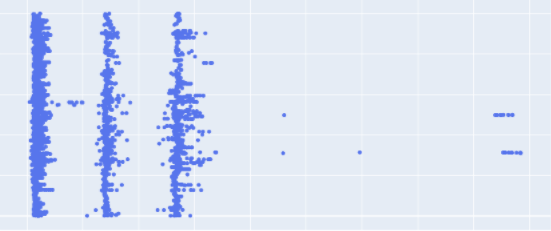
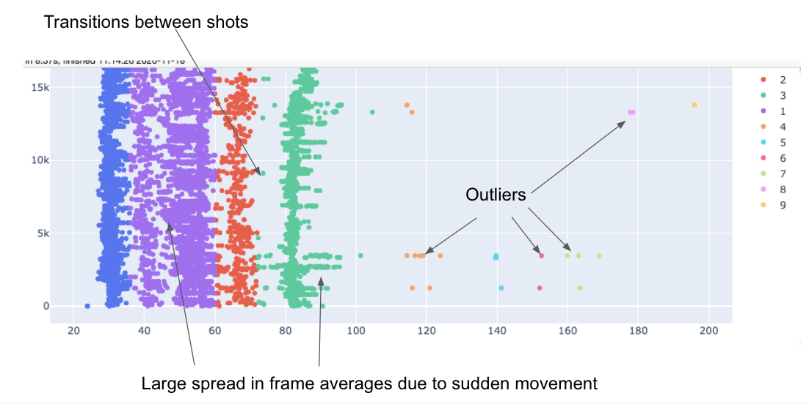
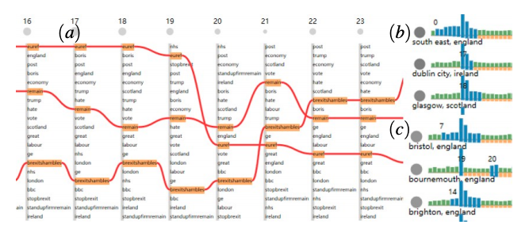

# Methodology

Here I discuss the methods I used for data collection, data wrangling, and visualization. Along the way I also share some limitations from these methods.

### Data Collection

[Github](github.com/kierangilliam/jre-data-wrangling)

This step was pretty straightforward: use the YouTube API to collect episode details, captions, and statistics. I used youtube-dl to download all of the videos publicly available on the JRE channel at 360p, ~30fps. This totaled to be almost 700gb of data. I got rate limited. A lot.

##### Limitations

YouTube captions are pretty good but definitely are nowhere near human-level transcription. I played around with some open source speech-to-text libraries like deepspeech, but didn't have the compute power, at the end of the day, to process all 1500+ episodes. I am therefore at the mercy of father Google.

### Data Wrangling

All of these methods have a shared commonality: unsupervised and computationally cheap enough to run on my laptop. 1500+ episodes is far too many to manually sift through and label. I needed methods that may not be 100% accurate, but were good enough at generalizing.

#### Screen Time

In this section, I wanted to ask was, 'is the conversation dominated by one person, or does it have equal representation from all parties?' The process of speaker segmentation from audio is called diarization. This led me to trying several diarization techniques. I tried approaches from my own (terrible) home-brewed spectrogram CNN to libraries such as pyannote. However, nothing I tried was 1\. quick enough for 3600+ hours of audio or 2\. anywhere near accurate.

When I was building the spectrogram CNN, I realized that I would need some sort of way to validate it was working without having to listen to the classified audio. So, as a proxy to diarization, I built a pretty naive solution. The first step was to take the average across frames to produce a list of scalars.

When visualized over time, this is what they look like.

As you can see, clusters form nicely out these averages. The next step was to use a 1D clustering algorithm. I chose KDE. This ended up proxying diarization pretty well, so I dropped my attempts at a DL solution in place for this naive method.

##### Limitations

For a good majority of the episodes, this method works pretty well. It fails terribly when there is a lot of movement in the podcast.

If I were to spend more time on this project, I would create some way to automatically prune episodes with a large frame-average spread. If you notice a chart in the screentime section that inaccurately represents that episode, please submit an issue.

#### Topics

Loosely, TF-IDF is a cheap algorithm that gives each word in a document (an episode, in this case) an _importance_ score. Words that appear commonly in all documents are given a low score. Words that appear many times in a handful of documents, but seldom in the majority, are given high scores for the former documents and low scores for the latter documents. Google uses this technique when ranking what webpages it shows you.

It is often the case you will need to _stem_ words to get the most effectiveness out of TF-IDF. Stemming is basically process shortening a word to its most generic version; 'answer, answering, answered' would all have the same stem, 'answer', for example.

##### Limitations

The **topics over time** chart will not show every single occurrence of a given word. This is mainly due to the fact I couldn't get captions for every single video and the captions aren't always accurate.

#### Episode Similarity

Similarity could be ranked in many ways... How many likes did an episode get? How often does Joe shout? What is the aggregate sentiment in the comments section? I opted to rank similarity based on how similar topics were across episodes.

This method relied heavily on the TF-IDF scores addressed above. We can treat the TF-IDF scores as vectors and use the cosine angle between two vectors to score their similarity. If that made sense, great, if not, [this article]('https://towardsdatascience.com/tf-idf-for-document-ranking-from-scratch-in-python-on-real-world-dataset-796d339a4089') does a good job at explaining this concept.

As you have have noticed, this method works very well for determining similarity. Musicians are often grouped with other musicians, comics with comics, and scientists with scientists.

### Data Visualization

#### Topics Over Time

This was heavily inspired by [this]('https://diglib.eg.org/bitstream/handle/10.2312/eurova20181105/007-011.pdf?sequence=1&isAllowed=y') paper's visualization:

Stemming is communicated using a constantly updating element that shows the user that extinct, extinction, and extinctions all mean the same thing in this context.

#### Performance

Performance was my main enemy during this project. The main performance killers came from loading the large data files (the episode similarity data file has over a million rows), and javascript evaluation and execution (parsing data or animating).

I could have chopped up big data files and lazily requested data as users clicked on different episodes or topics, but that would just defer the lag to a later stage. I'd rather have the client chug a few dozen megabytes and then have a smooth experience after that, than to have many constant pauses as data is fetched lazily.

Instead of chopping up a csv, I used protobufs, instead, to minimize the footprint of the data. The aforementioned 1,000,000 row file as a csv is about ~60mb. When converted to protobufs, it takes up around ~15mb.

Though, because I have gone for the data-chug route, the _time to first interaction_ suffers. I alleviate this using three methods: 1\. intersection observers, 2\. web workers, and (paradoxically) 3\. another chart.

##### Intersection Observers

The Intersection Observer API allows you to subscribe to an element's visibility status. The use case here was obvious and simple: don't render animating content when the user could not see that section of the page.

##### Web Workers

Web Workers allow you to execute javascript off of the main thread. This is handy when you, for example, have some computationally heavy work that you need to do client-side but don't want the webpage to render clunkily. I used webworkers to download and parse my data.

##### Like Ratio / Views Line Chart

I added this chart last minute because I needed something relatively eye-grabbing that would make a user pause for a second before scrolling. This chart uses a (proportionally) small 300kb 'episodes' csv file that every visualization depends on. As the user parses the somewhat opaque visualization, I load and parse all of the data in the background that is used for the other visualizations.

##### Svelte

Finally, I need to mention Svelte. Svelte is a faster and lightweight alternative to frameworks like React, Angular, or Vue. Furthermore, it is very straightforward to use, making the design iteration phase fairly quick.